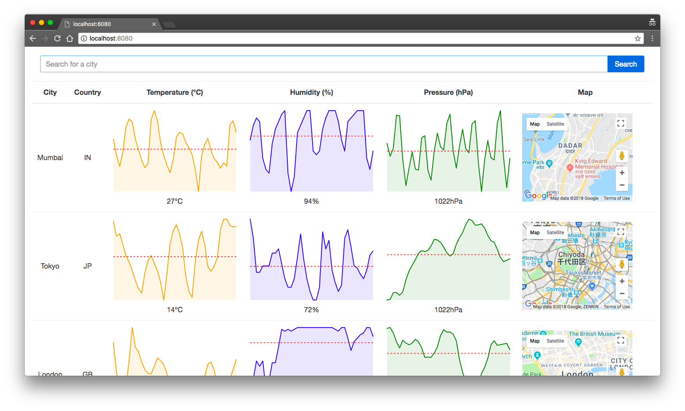

# CityInfo
react-redux app to get city information

Hey there,

This is a react-redux application which displays information on cities. Open Weather API and Google Maps API are used here to display information.
For charts, react-sparklines is used.

## Features

* Simple, Clean and Light UI
* Charts for better data visualization
* Search Bar to search for cities
* Interactive Map Component

## ScreenShot

<p align="center">

</p>

## To get started

1. Download or clone this repo
2. Make sure you have node.js
3. cd to your project folder
4. Run this command to install all the dependencies<br> ```npm install```
5. Run this command to start the app<br>
```npm start```
6. Open browser and go to http://localhost:8080/

## Queries?

email me at pranavj1001@gmail.com

## License

MIT License
